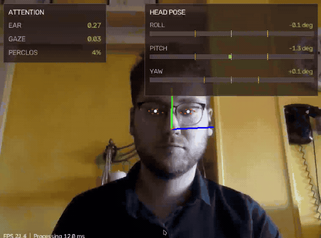

# Real Time Driver State Detection
   

Real-time, webcam-based driver attention monitoring using Python, OpenCV, and MediaPipe.



**Note**:
This work is partially based on [this paper](https://www.researchgate.net/publication/327942674_Vision-Based_Driver%27s_Attention_Monitoring_System_for_Smart_Vehicles) for the scores and methods used.

## What's New

- Updated to the MediaPipe Face Landmarker Tasks API with 478 face and iris landmarks.
- Fixed gaze, EAR, head-pose, missing-face, timing, and PERCLOS calculations.
- Added a responsive dashboard with signed roll, pitch, and yaw bars.
- Migrated dependency management to uv and added a verified local model download.
- Improved camera calibration, command-line validation, cleanup, and automated tests.

MediaPipe integration was originally added with help from [MustafaLotfi](https://github.com/MustafaLotfi). The older dlib implementation remains available in the `dlib-based` branch.

## How Does It Work?

The application detects the driver's face and uses MediaPipe to predict 478 face and iris landmarks.
The enumeration and location of all the face keypoints/landmarks can be seen [here](./demo/face_keypoints.jpg).

With those keypoints, the following scores are computed:

- **EAR**: Eye Aspect Ratio, it's the normalized average eyes aperture, and it's used to see how much the eyes are opened or closed
- **Gaze Score**: L2 Norm (Euclidean distance) between the center of the eye and the pupil, it's used to see if the driver is looking away or not
- **Head Pose**: Roll, Pitch and Yaw of the head of the driver. The angles are used to see if the driver is not looking straight ahead or doesn't have a straight head pose (is probably unconscious)
- **PERCLOS**: PERcentage of CLOSure eye time, used to see how much time the eyes are closed in a minute. A threshold of 0.2 is used in this case (20% of a minute) and the EAR score is used to estimate when the eyes are closed.

The driver states can be classified as:

- **Normal**: no messages are printed
- **Tired**: when the PERCLOS score is >= 0.2, a warning message is printed on screen
- **Asleep**: when the eyes are closed (EAR <= closure_threshold) for a certain amount of time, a warning message is printed on screen
- **Looking Away**: when the gaze score is higher than a certain threshold for a certain amount of time, a warning message is printed on screen
- **Distracted**: when the head pose score is higher than a certain threshold for a certain amount of time, a warning message is printed on screen

## Demo

<video src="./demo/demo_new.mp4" controls="controls" muted loop style="max-width: 100%; height: auto;">
    Your browser does not support the video tag.
</video>

[Open or download the MP4 demo](./demo/demo_new.mp4)

## The Scores Explained

### EAR

**Eye Aspect Ratio** is a normalized score that is useful to understand the rate of aperture of the eyes.
Using the mediapipe face mesh keypoints for each eye (six for each), the eye lenght and width are estimated and using this data the EAR score is computed as explained in the image below:


**NOTE:** the average of the two eyes EAR score is computed

### Gaze Score Estimation

The gaze score gives information about how much the driver is looking away without turning his head.

To understand this, the distance between the eye center and the position of the pupil is computed. The result is then normalized by the eye width that can be different depending on the driver physionomy and distance from the camera.

The below image explains graphically how the Gaze Score for a single eye is computed:

**NOTE:** the average of the two eyes Gaze Score is computed

### Head Pose Estimation

For the head pose estimation, a standard 3d head model in world coordinates was considered, in combination of the respective face mesh keypoints in the image plane. 
In this way, using the solvePnP function of OpenCV, estimating the rotation and translation vector of the head in respect to the camera is possible.
Then the 3 Euler angles are computed.

The partial snippets of code used for this task can be found in [this article](https://learnopencv.com/head-pose-estimation-using-opencv-and-dlib/).

## Installation

The project uses [uv](https://docs.astral.sh/uv/) and a managed Python 3.12 environment. From the repository root, install the locked dependencies and download the checksum-verified Face Landmarker model:

```bash
uv sync --locked
uv run driver-state-detection-download-model
```

The model is saved as `models/face_landmarker.task`. Runtime detection is offline and reports a setup error if this file is missing. Use `--output` with the download command and `--model-path` with the application to choose another location.

## Usage

Run the application from the repository root:

```bash
uv run driver-state-detection
```

List the available options:

```bash
uv run driver-state-detection --help
```

For example, wait five seconds before reporting continuous eye closure and hide the pose axes:

```bash
uv run driver-state-detection --ear_time_thresh 5 --no-show-axis
```

Boolean display options support both positive and negative forms, such as `--show-fps` and `--no-show-fps`.

### Dashboard

The attention panel shows EAR and gaze with two decimal places and PERCLOS as a percentage. PERCLOS is marked as warming up until the rolling window has enough valid observations.

The head-pose panel uses signed bars centered on zero. Negative roll, pitch, and yaw fill left; positive values fill right. The fill is green within the configured threshold, amber near it, and red beyond it. Threshold markers remain visible on both sides of zero.

Useful display and scoring options include:

```bash
uv run driver-state-detection \
  --no-show-eye-keypoints \
  --perclos-thresh 0.20 \
  --perclos-window 60 \
  --roll-thresh 20 \
  --pitch-thresh 20 \
  --yaw-thresh 20
```

Detector confidence, timer decay, minimum valid PERCLOS coverage, and pose-bar ranges are also configurable. Run `uv run driver-state-detection --help` for the complete list and current defaults.

### Linux GUI Notes

The application configures OpenCV's bundled Qt 5 backend to use XCB through XWayland when running under Wayland. On KDE 6 it also isolates the older bundled Qt runtime from incompatible KDE font settings and uses installed system fonts when the OpenCV wheel does not include its expected font directory.

MediaPipe may still print XNNPACK and feedback-tensor messages when the Face Landmarker starts. These come from MediaPipe's native runtime and describe delegate/model capabilities; they are not detection failures. They are intentionally not hidden because redirecting native stderr would also hide actionable model errors.

## Development

Run the regression tests and formatting checks with:

```bash
uv run pytest
uv run black --check driver_state_detection camera_calibration tests
uv run isort --check-only driver_state_detection camera_calibration tests
```

## Why this project

This project was developed as part for a final group project for the course of [Computer Vision and Cognitive Systems](https://international.unimore.it/singleins.html?ID=295) done at the [University of Modena and Reggio Emilia](https://international.unimore.it/) in the second semester of the academic year 2020/2021.
Given the possible applications of Computer Vision, we wanted to focus mainly on the automotive field, developing a useful and potential life saving proof of concept project.
In fact, sadly, many fatal accidents happens [because of the driver distraction](https://www.nhtsa.gov/risky-driving/distracted-driving).

## License and Contacts

This project is freely available under the MIT license. You can use/modify this code as long as you include the original license present in this repository in it.

For any question or if you want to contribute to this project, feel free to contact me or open a pull request.

## Improvements to make

- [x] Reformat code in packages
- [x] Add argparser to run the script with various settings using the command line
- [x] Improve robustness of gaze detection (using mediapipe)
- [x] Add argparser option for importing and using the camera matrix and dist. coefficients
- [x] Reformat classes to follow design patterns and Python conventions
- [ ] Debug new mediapipe methods and classes and adjust thresholds
- [x] Improve perfomances of the script by minimizing image processing steps
